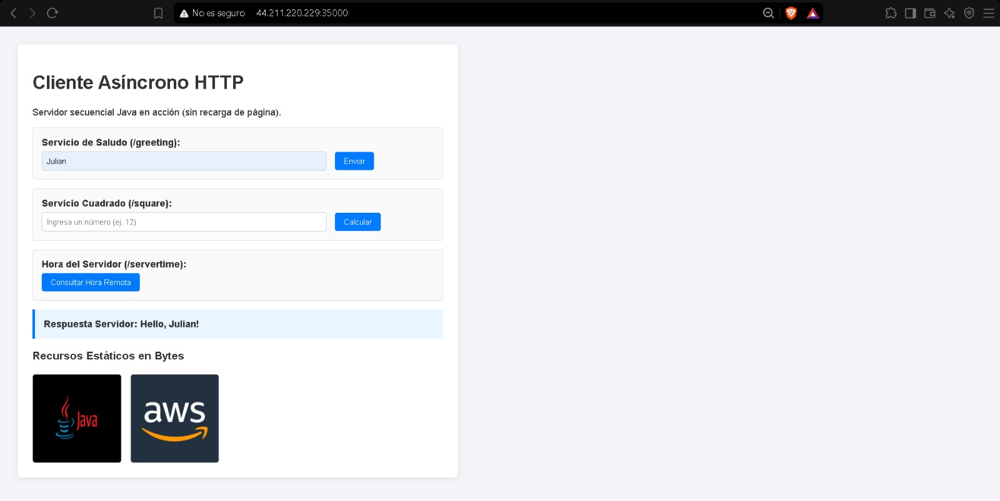
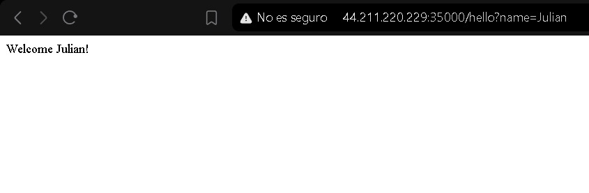
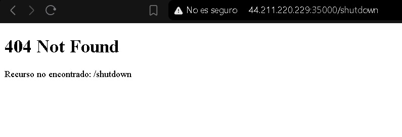

# Building and Deploying a Maintainable Application Server (Web Framework)

**Student:** Julián Ramírez
**Course:** Enterprise Architecture - Escuela Colombiana de Ingeniería Julio Garavito
**Cloud Deployment (AWS EC2):** `http://44.211.220.229:35000/`

---

## 1. Project Description

In this lab, the previous sequential HTTP server was evolved into a **lightweight, independent web micro-framework**. The architecture completely decouples the underlying TCP socket processing from the application's business logic, allowing developers to register dynamic `GET` endpoints using Java lambda functions.

### Key Features

* **Fluent & Intuitive API:** Route registration via `get("/route", (req, resp) -> ...)` and static resource configuration using `staticfiles("/public")`.
* **Static File Service:** Unified serving of text resources (HTML, JS, CSS) and binary files (PNG/JPEG images) read directly as byte streams.
* **Query Parameter Extraction:** `Request` abstraction supporting multiple query-string parameters (`req.getValue("param")`) without crashing on missing values.
* **Externalized Configuration:** Environment variable reading for `PORT`, `GREETING_PREFIX`, and `APP_ENV`.
* **Graceful Sequential Shutdown:** Sequential server shutdown via the `/shutdown` endpoint, automatically restricted to run only in development environments (`APP_ENV=development`).

---

## 2. System Metaphor: "The Office Building"

To explain the separation of concerns and the request lifecycle, the system is described using an office building metaphor:

| Metaphor Component            | Framework Component          | System Responsibility                                                                                                                  |
| ----------------------------- | ---------------------------- | -------------------------------------------------------------------------------------------------------------------------------------- |
| **Front Desk / Receptionist** | `HttpServer`                 | Receives visitors (TCP requests), parses HTTP headers, and delivers the final response.                                                |
| **Lobby Directory**           | `Router`                     | Looks up registered routes to direct the visitor to the correct office.                                                                |
| **Specialized Offices**       | Lambda Handlers (`Route`)    | Execute specific business logic to handle the requested query.                                                                         |
| **Document Archive**          | `StaticFileService`          | Serves physical files (HTML, JS, images) when no dynamic office matches the request.                                                   |
| **Building Regulations**      | Environment Variables        | Define global operational rules such as entry port or execution environment (`APP_ENV`).                                               |
| **Closing Procedure**         | Graceful Shutdown (`stop()`) | Finishes serving the current visitor at the desk, closes the main door, and powers down without interrupting active requests abruptly. |

---

## 3. Architecture and Maintainability

The project evolved from a tightly coupled structure using `if/else` blocks into a clean, extensible architecture.

### Architecture Diagram

```text
Application (main)
    │ Registers routes with lambdas and staticfiles()
    ▼
WebFramework (Public API Facade)
    │ Exposes get(), staticfiles(), start(), stop()
    ▼
Router ─────────────────────────► Lambda Handlers (/hello, /square, /pi)
    │ (If route matches)
    ▼ (If no match - Fallback)
StaticFileService ──────────────► Resources (index.html, script.js, logo.png)
    │
    ▼
HttpServer (Sequential TCP Socket Loop)
```

### Applied Maintainability Principles

| **Principle**              | **Application in this Project**                                                                                                |
| -------------------------- | ------------------------------------------------------------------------------------------------------------------------------ |
| **Separation of Concerns** | Low-level HTTP infrastructure (sockets) is completely isolated from business logic.                                            |
| **Low Coupling**           | Adding a new endpoint does not require modifying the server's connection processing loop.                                      |
| **High Cohesion**          | Each class has a single focused responsibility (`Router` maps routes, `Request` parses data, `StaticFileService` reads bytes). |
| **Abstraction**            | Developers interact via `get()` and `req.getValue()` without manually managing sockets or I/O streams.                         |
| **Extensibility**          | Unlimited new endpoints can be added simply by registering functions.                                                          |

### Project Structure

```text
src/
├── main/
│   ├── java/
│   │   └── com/
│   │       └── escuelaing/
│   │           └── edu/
│   │               └── app/
│   │                   ├── Application.java        # Entry point & route registration
│   │                   ├── HttpServer.java         # TCP engine & lifecycle (start/stop)
│   │                   ├── Request.java            # Request abstraction & query parsing
│   │                   ├── Response.java           # Response abstraction & headers
│   │                   ├── Route.java              # Functional interface for lambdas
│   │                   ├── Router.java             # Route lookup registry
│   │                   ├── StaticFileService.java  # Static resource & byte stream handler
│   │                   └── WebFramework.java       # Framework public facade API
│   └── resources/
│       └── public/
│           ├── index.html
│           ├── script.js
│           ├── image1.png
│           └── image2.jpg
```

---

## 4. Local Build and Execution

### Prerequisites

* Java JDK 17 or higher (developed and tested on Java 21).
* Apache Maven 3.8+.

### Steps

#### 1. Compile and package the application into a runnable Fat-JAR

```bash
mvn clean package
```

#### 2. Run the application with default settings

The application runs on port `8080` with `APP_ENV=development`.

```bash
java -jar target/networking-lab2-1.0-SNAPSHOT.jar
```

#### 3. Test custom environment variables locally

Using PowerShell:

```powershell
$env:PORT="9000"
$env:GREETING_PREFIX="Hola"
$env:APP_ENV="development"

java -jar target/networking-lab2-1.0-SNAPSHOT.jar
```

---

## 5. Endpoints & Example Usage

| **Endpoint / Resource** | **Type**  | **Description / Example**    | **Expected Response**                                       |
| ----------------------- | --------- | ---------------------------- | ----------------------------------------------------------- |
| `/index.html`           | Static    | `GET /` or `GET /index.html` | HTML5 Web UI served with CSS/JS.                            |
| `/image1.png`           | Static    | `GET /image1.png`            | Binary image resource served in bytes (`image/png`).        |
| `/hello`                | Lambda    | `GET /hello?name=Pedro`      | `Hello Pedro!` (or uses `GREETING_PREFIX`).                 |
| `/pi`                   | Lambda    | `GET /pi`                    | `3.141592653589793`.                                        |
| `/greeting`             | Lambda    | `GET /greeting?name=Julian`  | `{"greeting":"Hello, Julian!"}`.                            |
| `/square`               | Lambda    | `GET /square?value=12`       | `{"value":12.0,"square":144.0}`.                            |
| `/shutdown`             | Lifecycle | `GET /shutdown`              | Gracefully stops the server (development environment only). |

---

## 6. Cloud Deployment (AWS EC2)

The application was deployed to a dedicated Amazon EC2 instance.

### Instance Configuration

1. **Instance Type:** Amazon Linux 2023 (`t2.micro`).
2. **Network Configuration:** Security Group with ports `22` (SSH) and `35000` (Custom TCP) enabled.
3. **Production Execution:**

   To ensure cloud security, the server was launched with `APP_ENV=production`, which automatically disables the `/shutdown` endpoint.

```bash
PORT=35000 GREETING_PREFIX="Welcome" APP_ENV=production nohup java -jar app.jar > server.log 2>&1 &
```

4. **Verification:**

Requesting `/shutdown` on the production AWS URL returns an HTTP `404 Not Found` response, safeguarding the process against unauthorized termination.

### Cloud URL

```text
http://44.211.220.229:35000/
```

---

## 7. Evidence of Operation

### 1. Web UI & Static Resources


### 2. Lambda Endpoints Responses


### 3. Production Protection (/shutdown returns 404)


## 8. License & Author

* **Author:** Julián Ramírez
* **Course:** Enterprise Architecture - Escuela Colombiana de Ingeniería Julio Garavito
